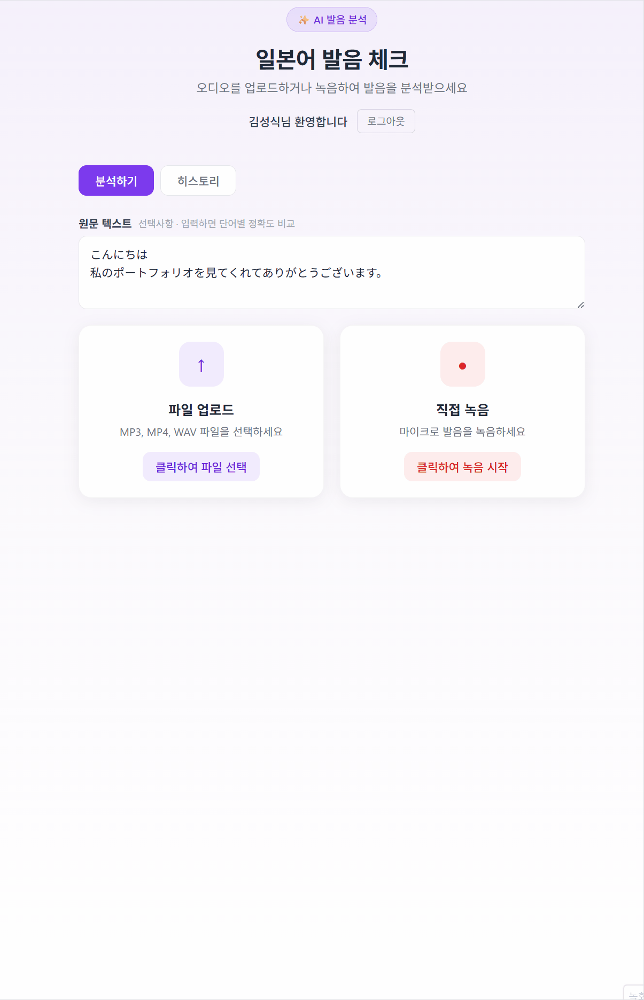
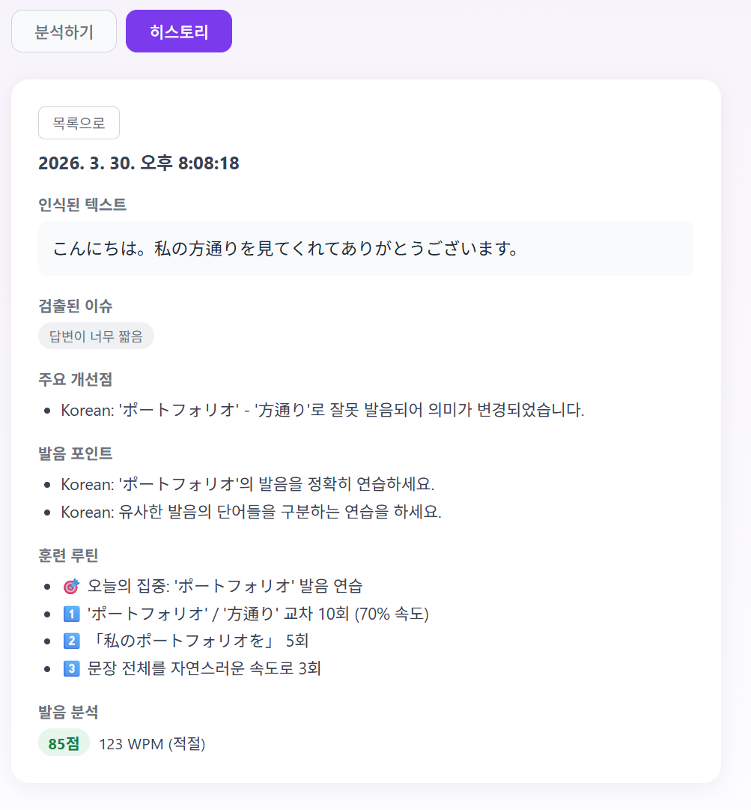
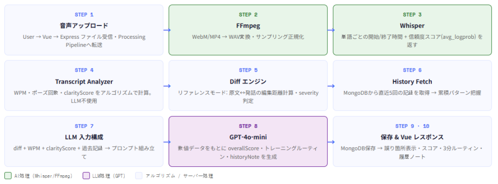

# JP Interview Coach

このプロジェクトの README は日本語と韓国語で提供されています。
이 프로젝트의 README는 일본어와 한국어로 제공됩니다.

- [日本語 (Japanese)](README.md)
- [한국어 (Korean)](README_ko.md)

---

## 目次

1. [プロジェクト概要](#プロジェクト概要)
2. [主な機能](#主な機能)
3. [システム構成](#システム構成)
4. [技術スタック](#技術スタック)
5. [技術的課題と解決](#技術的課題と解決)
6. [設計で工夫した点](#設計で工夫した点)
7. [実行方法](#実行方法)

---

## プロジェクト概要

日本語面接を準備している人が、一人でも発音をチェックし改善できるように作られた
AI ベースのコーチングサービスです。

面接の映像や音声をアップロードすると、話す速度・間の取り方・発音の明瞭度を数値で分析し、
過去の練習記録を基に、今日重点的に取り組む 3 分間のトレーニングルーチンを提案します。

単なる一回限りの分析ツールではなく、練習を重ねるほどより正確なフィードバックを提供する
**累積型コーチング構造**として設計しました。

---

## 主な機能



### リファレンスモード
入力した文章を録音すると、原文と実際の発話を単語単位で比較。
誤り・欠落・追加された単語を視覚的に表示し、重大度（高 / 中 / 低）を提示します。

### 自由発話モード
決まった文章がなくても自由に話した内容を分析できます。
話す速度（WPM）・ポーズの回数・Whisper の認識信頼度をもとに、発音品質スコア（0〜100）を算出します。

### 3 分トレーニングルーチン
分析結果をもとに、その日に修正すべき箇所を集中的に練習する 3 段階ドリルを提示します。
実際に間違えた単語を繰り返し練習する仕組みのため、一般的な例文推薦より効果的です。

### 累積コーチング
ログインユーザーの練習履歴を蓄積し、AI が直近 5 回の記録を参照して
「前回よりフィラーが減っていますね」のような文脈のあるフィードバックを提供します。



---

## システム構成



```
音声入力（録音 or ファイルアップロード）
        ↓
  [FFmpeg]  動画 → 音声抽出・形式変換
        ↓
  [Whisper]  音声 → テキスト + 単語タイムスタンプ + 信頼度スコア
        ↓
  [Transcript Analyzer]  WPM・休止回数・明瞭度をアルゴリズムで数値化
        ↓
  [Diff エンジン]  原文 vs 認識結果を単語単位で比較（リファレンスモード）
        ↓
  [GPT-4o-mini]  数値データをもとにコーチングフィードバック・ルーチン生成
        ↓
  [MongoDB]  セッション保存 → 累積フィードバックへ活用
```

---

## 技術スタック

| カテゴリ | 技術 |
|----------|------|
| Frontend | Vue 3 (Composition API) · Vite |
| Backend | Node.js · Express · TypeScript |
| Speech AI | OpenAI Whisper API |
| Audio Processing | FFmpeg |
| AI Coaching | OpenAI GPT-4o-mini |
| Database | MongoDB · Mongoose |
| Authentication | JWT · bcryptjs |
| Infrastructure | Docker · Docker Compose · nginx |

---

## 技術的課題と解決

**Problem**

同じ録音データを送信しても、異なるフィードバックが生成される問題が発生しました。
LLM が主観的に評価する構造だったため評価基準が安定せず、
ユーザーが実際の上達を確認しにくい状態でした。

**Solution**

ユーザーが「読むべき文章」を直接入力できる仕組みを導入し、比較対象となる正解データを固定しました。
評価はアルゴリズム（距離計算）が担当し、LLM は分析結果をユーザーが理解できる言語へ変換する役割のみに分離しました。

**Result**

同じ録音データに対して常に同じ比較結果が得られるようになり、評価の一貫性を確保。
フィードバックも常に実際の分析データに基づいて生成されるようになりました。

---

## 設計で工夫した点

**LLM が根拠なく評価しないように評価構造を設計しました。**

LLM に「発音を評価して」と任せると、実際の音声を直接評価できず、
文字情報のみを基に判断してしまうためハルシネーションが起きる可能性がありました。

そこで LLM が介入する前に Whisper のデータを基に
話速・休止回数・認識信頼度を数値として測定し、その数値を評価の根拠として渡す構造にしました。
**LLM は評価を行うのではなく、すでに測定された結果を解釈する役割のみを担います。**

---

## 実行方法

### 必要なもの
- Docker / Docker Compose
- OpenAI API キー

### セットアップ

```bash
git clone <repository-url>
cd jp-interview-coach

# 環境変数を設定
cp backend/.env.example backend/.env
# OPENAI_API_KEY を入力

# 起動
docker-compose up --build
```

> ※ OpenAI API の利用コストを考慮し、公開デプロイは行っていません。
